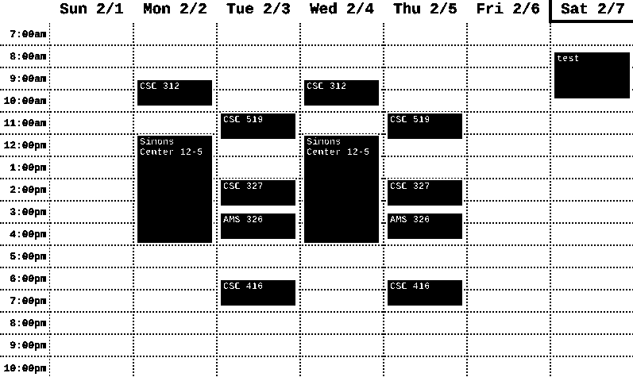
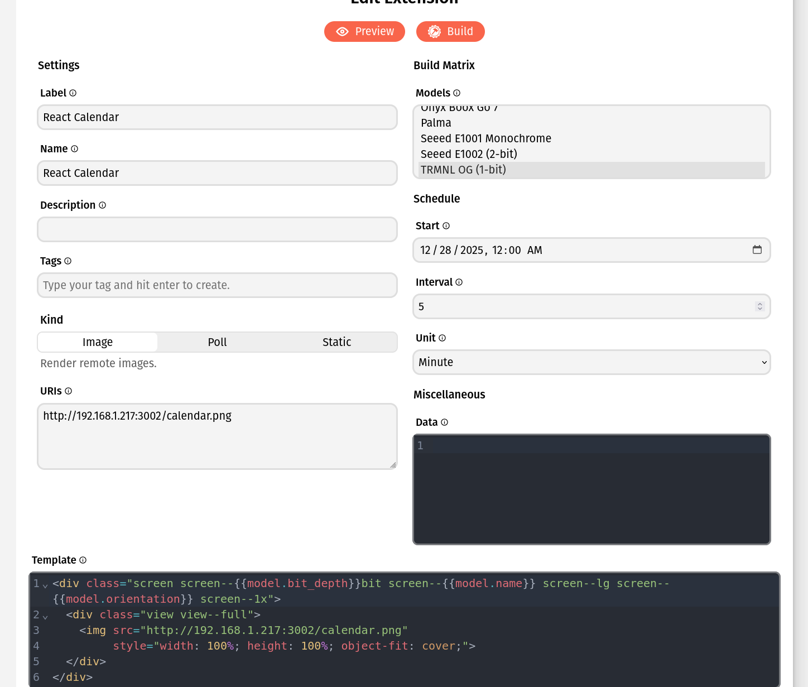

# E-Ink Calendar Dashboard

A full-stack application that renders a Google Calendar view into a high-contrast, dithered PNG image optimized for E-ink displays (Like the trmnl OG 1bit).



Generated Images you can send to your BYOS Terminal server like so:


## 📂 Project Structure

- `server/`: Node.js/Express backend that fetches the `.ics` data and uses Puppeteer to screenshot the calendar.
- `client/`: React frontend that displays the calendar UI.

## 🚀 Setup & Installation

### 1. Install Dependencies

#### Server

```bash
cd server
npm install
```

```Client
cd ../client
npm install
```

###2. Congigure Environment
Create a file named .env in the server/ directory and add your private Google Calendar URL:
```env
ICAL_URL=https://calendar.google.com/calendar/ical/YOUR_PRIVATE_LINK/basic.ics
```
Note: Do not wrap the URL in quotes.

### 3. Build the Frontend
Before the server can generate an image, the client must be built:
```bash
cd ../client
npm run build
```

## 🛠 Usage
Start the server from the ```server/``` directory:
```
cd ../server
node server.js
```
The server will start on:
```
http://localhost:3002
```
## 🔌 API Endpoints

| Endpoint           | Description                                                              |
|--------------------|--------------------------------------------------------------------------|
| GET /calendar.png  | (Main) Returns the processed, binary black & white PNG image.           |
| GET /feed.ics      | Proxies the raw Google Calendar iCal data securely.                     |
| GET /              | Serves the built React client (HTML view of the calendar).              |

## ⚙️ Tech Stack

Server: Node.js, Express, Puppeteer, Sharp

Client: React, Vite

Deployment: Designed for local hosting (trmnl)
